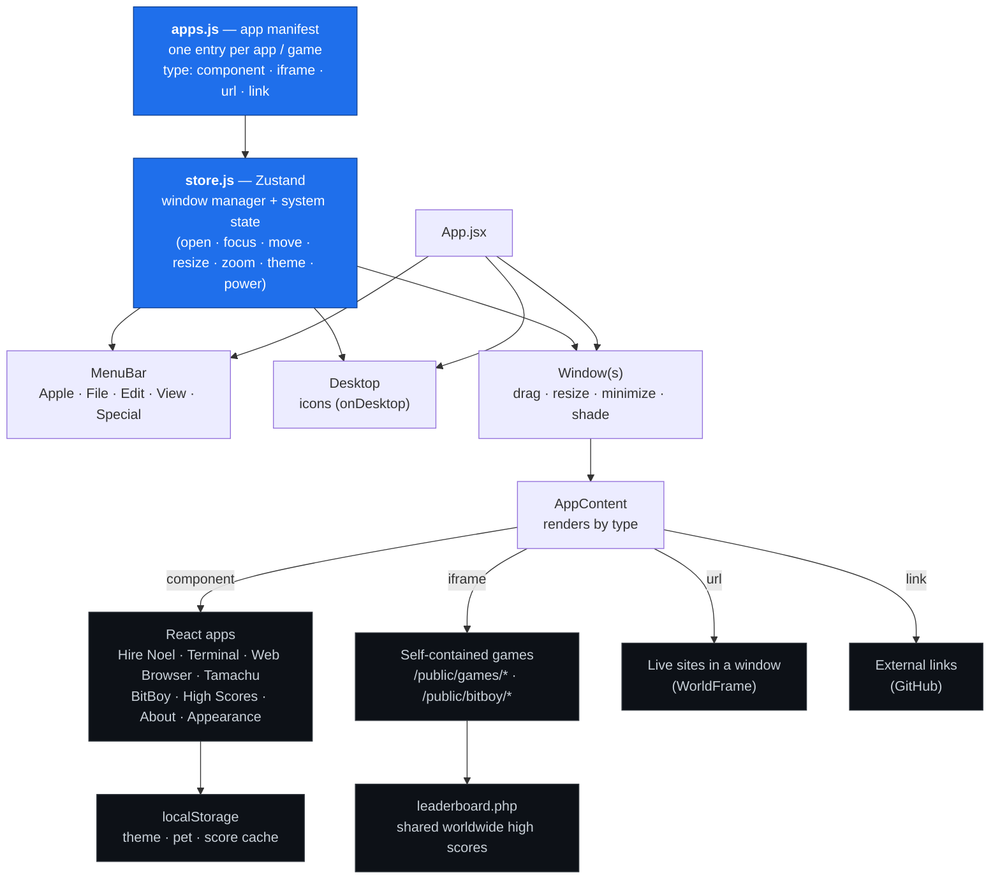

# Sturdy Robot — a portfolio built as a working Macintosh

[](https://github.com/SturdyRobot/mac-portfolio/actions/workflows/ci.yml)

**Live:** [sturdyrobot.io](https://sturdyrobot.io)

**Stack:** React 18 · Vite · Zustand · Zod · three.js + cannon-es · Cloudflare Workers · Web Audio — built **AI-native**, directed with Claude Code. See [AI_SPEC.md](AI_SPEC.md).

A personal portfolio disguised as a fully working **classic Mac OS 8 "Platinum"
desktop** — draggable windows, a live menu bar, system sounds, theme "flavors",
and a set of real apps and games. Nothing here is a screenshot of my work; every
icon on the desktop *is* the work, running in the browser.

The interesting part for a reviewer isn't the nostalgia skin — it's that the whole
desktop is a small, **pluggable platform**. Apps, games, site-redesigns, and
themes are all registered data; adding a new project to the entire "OS" is a
one-line manifest entry.

---

## Architecture



Everything flows from two files. **`apps.js`** is the manifest — a plain list
describing each app's type, icon, window size, and whether it appears on the
desktop, in the menu, or both. **`store.js`** is a tiny Zustand-based window
manager: it owns open windows, z-order/focus, drag/resize/minimize/window-shade,
the active theme, and the system power state. Everything else (`MenuBar`,
`Desktop`, `Window`, `AppContent`) is a thin view over that state.

Adding a project is one entry:

```js
{
  id: 'my-thing',
  name: 'My Thing',
  category: 'Projects',
  icon: '🛠️',
  type: 'iframe',            // component | iframe | url | link
  src: '/games/my-thing/index.html',
  window: { w: 640, h: 480 },
  onDesktop: true,
  menu: true,
}
```

---

## What's inside

**Apps** (React components running as "native" OS apps)

| App | What it is |
|-----|------------|
| **Hire Noel** *(Scope Generator)* | A real client-intake tool: a guided wizard → a validated, itemized project scope with a downloadable **PDF** quote. Deterministic **Zod** pricing engine; an optional Groq LLM layer (via a rate-limited Cloudflare Worker) only *polishes the prose* — it can never change the numbers. [More below ↓](#featured-build--the-scope-generator-hire-noel) |
| **Start Here** | The welcome hub — who I am and where to look first. |
| **Terminal** | A working retro shell over a virtual filesystem: `ls`/`cd`/`cat`, `open <app>` (actually launches apps), `neofetch`, command history, plus a pile of developer easter eggs and a hidden `hack` sequence that unlocks a CTF-style flag. |
| **Web Browser** | An in-OS browser where typing a real domain loads *my redesign* of that site (a pluggable site registry). |
| **High Scores** | A worldwide arcade leaderboard, backed by a small PHP endpoint with a `localStorage` fallback. |
| **Tamachu** | A full Tamagotchi-style virtual pet — life stages, stats, sickness, discipline, death & rebirth, 3 mini-games, hand-drawn 16×16 sprites, saved across visits. |
| **Appearance** | Control panel to switch between 7 iMac G3 theme "flavors" (live, remembered). |
| **About Me** | The short bio + contact. |

**Games**

| Game | Tech |
|------|------|
| **RC Playground** | A 3D driving time-trial — real physics via **three.js + cannon-es** (suspension, jumps, boost pad, lap timer). |
| **Zenomon** | A deep single-file monster-breeding sim — genome splicing with IV/EV stats, a multi-currency economy, auto-battle, prestige, quests. Vanilla JS, saves locally. |
| **Raid Clicker** | A Tarkov-style extraction-looter incremental — loadouts, survivability, raids, stash, scav runs, season/prestige wipes. |
| **BitBoy** | A working handheld console; its on-screen D-pad/A/B forward real key events into swappable "cartridges" (**Jungle Run**, **Snake**). |
| **Breakout** | The arcade classic, wired into the shared leaderboard. |

---

## Featured build — the Scope Generator ("Hire Noel")

The most architecturally interesting piece, and a real lead-intake tool. A guided
wizard turns a few choices into a validated, itemized project scope with a
downloadable PDF quote — structured so the **LLM can never touch a number**:

- **Deterministic core.** A pure pricing engine (`pricing.js`) turns the intake into
  a quote — same input → same output, every time. The figure is defensible, not
  model-invented.
- **Zod at every boundary.** Schemas validate the intake *in*, the scope *out*, and
  the model's reply — so a bad LLM response can't reach the document.
- **LLM sandboxed to prose.** An optional [Cloudflare Worker](worker/) injects a Groq
  key server-side (never in the browser), rate-limits by IP, and is told the price is
  fixed — it only writes the sentence *around* the numbers. The reply is re-validated
  client-side before it's shown.
- **Graceful degradation.** Ships fully functional with **no backend** (deterministic
  summary); the AI is progressive enhancement. jsPDF is lazy-loaded, so it never
  weighs down first paint.

Layered as `src/apps/scope/` — `catalog` (rate card) → `schema` (Zod) → `pricing`
(pure engine) → `summarize` (optional LLM) → `pdf` → `ScopeGenerator` (UI) — with
`worker/` holding the edge proxy and a one-command deploy.

---

## Tech stack

- **UI:** React 18, Vite 5, [Zustand](https://github.com/pmndrs/zustand) for the window-manager store.
- **Scope engine:** [Zod](https://zod.dev) schemas + a pure deterministic pricing engine; [jsPDF](https://github.com/parallax/jsPDF) (lazy-loaded) for client-side quote PDFs.
- **Edge:** a Cloudflare Worker proxies the optional LLM summary (Groq), keeping the API key server-side and rate-limiting by IP.
- **Type safety:** the manifest + window-store are strict-TypeScript-checked via `// @ts-check` + `tsc --noEmit` (see `src/types.d.ts`); ESLint + build run in CI.
- **3D game:** three.js + cannon-es. Other games are hand-written vanilla JS/Canvas, each fully self-contained in `/public`.
- **Backend:** a single PHP script (`leaderboard.php`) for shared high scores.
- **Persistence:** `localStorage` (theme, pet, score cache); PHP for the global board.
- **Audio:** Web Audio API — sounds are synthesized, not files.
- **Hosting:** static build + PHP on Hostinger, served at [sturdyrobot.io](https://sturdyrobot.io).

---

## Run it locally

Requires Node 18+.

```sh
npm install
npm run dev        # http://localhost:5188
```

Build and preview a production bundle:

```sh
npm run build      # → dist/
npm run preview
```

Deploy is the contents of `dist/` plus `public/leaderboard.php` uploaded to the
web root. (The high-score board needs PHP; everything else is static and works
from any static host.)

---

## AI-Native development

This desktop was built with an **AI-native workflow** — I direct an AI coding
agent (Claude Code) as a pair programmer, and I own the architecture, the product
calls, and the final review. AI is a tool in the loop, not the author of record;
the point is that a single developer can direct it to build and *maintain* a
surface this wide without the quality dropping off. Where it was used:

- **Architecture & scaffolding.** I define the contracts — the manifest schema,
  the window-manager store's shape — and the agent builds components against them.
  I review, refactor, and throw work away when it's wrong.
- **Feature loops.** Work happens in tight cycles: I state intent, the agent
  drafts, I test and correct. The pluggable manifest exists specifically so those
  loops stay small and safe.
- **Asset generation, art-directed.** The pixel-art sprites (the Tamachu
  life-cycle, game art) and UI copy are AI-generated to my direction, then
  hand-tuned — not shipped raw.
- **Visual QA in the loop.** Changes are verified in a headless browser
  (screenshots, DOM and console checks, mobile viewport) before they land, so the
  UI is checked every change rather than eyeballed once.

The retro shell is deliberate cover for a serious idea: treat the portfolio as a
platform, and use AI to keep a broad, playful surface actually shippable and
maintained by one person.

---

## License

Personal portfolio project. Code is here to read and learn from; the branding,
copy, and art are mine. Ask if you'd like to reuse a piece.
